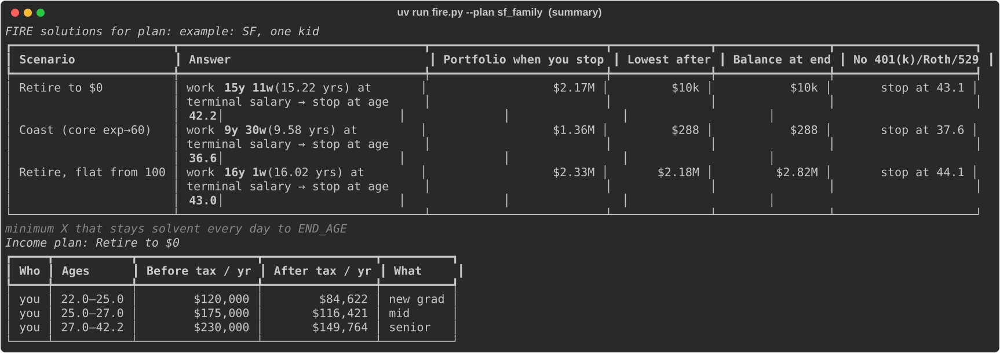
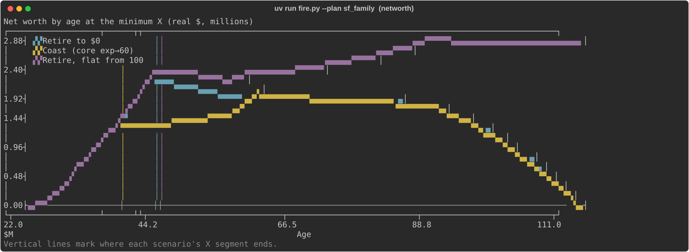
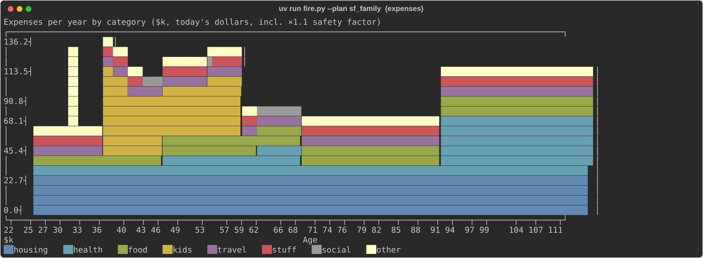
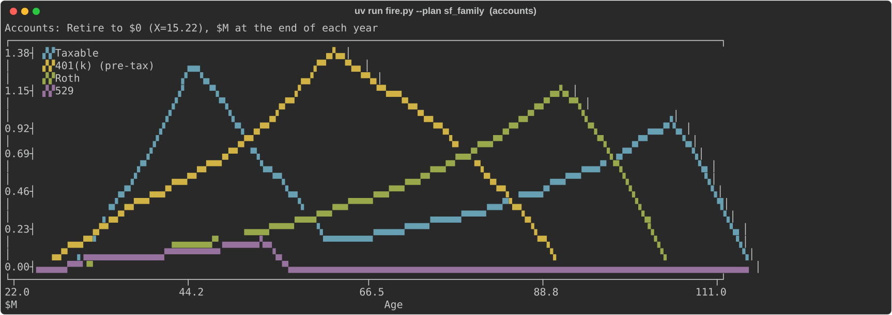
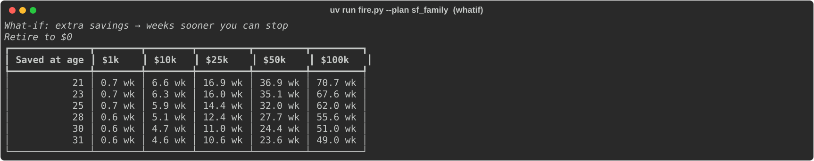
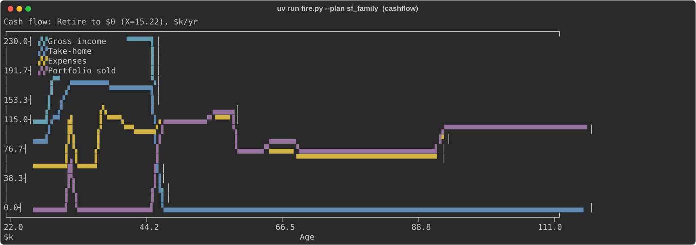

# fire: a day-by-day FIRE simulator

How many years at a big salary before you can coast, retire, or retire and never shrink your nest egg.

> **Heads up: this is a vibe-coded FIRE tool.** It was built in a conversation with Claude (an AI):
> someone described what they wanted, and Claude wrote the code, the tests and the design log.
> No financial professional has reviewed it. It is **not financial advice**. Use it to explore
> ideas, and check anything important with a real human who does this for a living.

## What is this?

It answers one question: **how long do I need to work at a high salary before I can stop, coast, or retire?**

To find out, it simulates your money **day by day to age 112** in real (today's) dollars. Each day,
wages arrive net of income tax, the day's expenses go out, and any surplus is invested. When there's a
shortfall, it sells from the portfolio and pays the tax on that sale. Every expense is padded by a
safety factor (1.1×). A bisection solver then finds the shortest stretch at the high salary (the `X`
in your income plan) that keeps the balance at or above $0 on every single day.

Each plan is solved for three goals: **retire to $0** (the money lasts until 112), **coast until 60**
(a job that pays your core expenses until 60), and **flat from 100** (the portfolio never shrinks after 100).

What you get out:

- For each goal, the **stop age** (to the day) and the **portfolio at that age**.
- An **income-plan table** (every salary segment, gross and after tax) and **terminal charts** (net worth,
  expenses by category, cash flow).
- **What-if tables**: how many weeks sooner you could stop if you saved an extra $A at age Y.
- **Moving cities**: live in one city's plan until an age, then another's; expenses and taxes switch at that age
  (`plan.move_to(other, at_age)`; example `sf_to_austin`: earn in SF, move to Austin at 35).
- **Grid sweeps** across plans, income ladders, partner incomes, tax setups and account types, in one table.
- **401(k) + Roth + 529** accounts, on by default; the summary also shows the answer without them (`--no-accounts` turns them off).

## What it looks like

`uv run fire.py --plan sf_family` (a shipped example: SF, one kid, a 120 → 175 → 230k ladder):






<details><summary>What-if table and cash flow</summary>




</details>

Regenerate these with `uv run docs/screenshots.py` (it only uses the shipped example plans).

## Using it with Claude Code

The plans are plain Python, so [Claude Code](https://claude.com/claude-code) works well as the interface. Describe
your life in plain English ("I make $180k, want two kids in my early 30s, might move somewhere cheaper at 35; when
can I coast?") and have it write the plan in `custom_plans/`, run `fire.py` / `grid.py`, and put the results side
by side. It's also good for questions like "what if my partner stops working?" or "does insurance really double for
a couple?", for sanity-checking expense estimates, and for keeping a log of the assumptions you chose. Keep
personal numbers in `custom_plans/` (gitignored) so they stay out of the repo.

## Quickstart

Requires [uv](https://docs.astral.sh/uv/). Dependencies are just `rich` and `plotext`.

```sh
uv sync                                                # install
uv run fire.py --list                                  # plans and grids you can run
uv run fire.py --plan sf_family                        # solve every goal: summary, what-ifs, charts
uv run fire.py --plan sf_family --no-plot --no-whatif  # summary and income plans only (about 1 s)
uv run fire.py --plan austin_family --budget           # print every expense line and exit
uv run fire.py --plan sf_to_austin                     # SF until 35, then Austin prices and Texas taxes
uv run grid.py grid_cities                             # sweep SF/Austin × ladders × partners × accounts
```

Main `fire.py` flags (`--help` for all). `uv run grid.py [NAME]` runs a grid (default `DEFAULT_GRID`).

| Flag | What it does |
|---|---|
| `--plan NAME`, `-p` | Which plan to run (default: `DEFAULT_PLAN`) |
| `--no-accounts` | Taxable brokerage only: no 401(k) / Roth / 529 (`config.NO_ACCOUNTS`) |
| `--budget`, `-b` | Print every expense line ($/mo, $/yr) and exit |
| `--compare-taxes` | Solve under each `TAX_VARIANTS` entry and compare |
| `--whatif A@AGE`, `-w` | How much sooner if you save an extra $A at AGE (repeatable) |
| `--x N` | Skip solving: simulate this one X and print the year-by-year table |
| `--sweep` | Also show the whole-year X sweep table and chart |
| `-s NAME` | Only run goals whose name contains NAME (repeatable) |
| `--table`, `-t` | Print the year-by-year table for each solution |
| `--no-plot` / `--no-whatif` | Skip the charts / the what-if grid |

### Make it yours

`default_plans/` holds the shipped examples. Your own plans go in `custom_plans/`, which is gitignored,
is searched first, and wins over a same-name default.

```sh
mkdir -p custom_plans
cp default_plans/sf_family.py custom_plans/my_plan.py      # then edit the numbers
cat > custom_plans/__init__.py <<'EOF'
DEFAULT_PLAN = "my_plan"
DEFAULT_GRID = "my_grid"
EOF
```

`custom_plans/` needs that `__init__.py` to be found. After that, a bare `uv run fire.py` runs your plan.
A grid (e.g. `custom_plans/my_grid.py`) is a module with a `GRID` dict of axes, each `{label: value}`.
Every combination is solved in parallel and printed as one table:

```python
from config import NO_ACCOUNTS, TAX_ADVANTAGED
from custom_plans.my_plan import PLAN
from default_plans.ladders import LADDERS

GRID = {
    "plans":    {"me": PLAN},                                         # required
    "ladders":  LADDERS,                                              # replaces plan.career
    "partners": {"solo": None, "+ $70k": 70_000},                     # via plan.with_partner
    "taxes":    {"CA": "CA, MFJ after wedding", "TX": "TX, MFJ after wedding"},
    "accounts": {"taxable": NO_ACCOUNTS, "401k+Roth+529": TAX_ADVANTAGED},
}
```

## SF vs Austin: taxes

From the bracket tables in `config.py` (2026 federal, 2025 CA; verify them): take-home pay and effective
total tax rate (federal + FICA + state, incl. CA's 1.3% SDI) for **wages only, one earner**, standard
deduction, no 401(k). "MFJ" means a $0-income spouse (the best case, as in `married()` in `config.py`).

| Gross wages | CA single | CA MFJ | TX single | TX MFJ |
|---:|---:|---:|---:|---:|
| $100k | $72.7k (27.3%) | $81.0k (19.0%) | $79.2k (20.8%) | $84.7k (15.3%) |
| $150k | $102.0k (32.0%) | $115.4k (23.1%) | $113.8k (24.1%) | $123.2k (17.9%) |
| $200k | $131.8k (34.1%) | $146.3k (26.8%) | $148.9k (25.5%) | $159.3k (20.3%) |
| $250k | $160.8k (35.7%) | $179.2k (28.3%) | $183.2k (26.7%) | $197.5k (21.0%) |
| $300k | $187.5k (37.5%) | $210.7k (29.8%) | $215.2k (28.3%) | $234.3k (21.9%) |
| $400k | $239.3k (40.2%) | $273.7k (31.6%) | $277.8k (30.5%) | $307.9k (23.0%) |

The marginal rate on the next dollar of wages (C = CA single, t = TX single). The step down near $185k is
the Social Security wage base. Above $200k, California adds roughly 10 points.

```
           Total marginal rate (fed + FICA + state), single, one earner
  ┌────────────────────────────────────────────────────────────────────────────┐
50┤ CC CA single                                           CCCCCCCCCCCCCCCCCCCC│
  │ tt TX single                            CCCCCCCCCCCCCCCC                   │
  │                                 CCCCCCCC                                   │
40┤           CCCCCCCCCCCCCCCCC    C                                           │
  │         CCC               C  CCC        ttttttttttttttttttttttttttttttttttt│
  │         C                 CCC   tttttttt                                   │
  │         C        tttttttttt    t                                           │
30┤         ttttttttt         t    t                                           │
  │    CCCCCt                 tttttt                                           │
  │    C    t                                                                  │
20┤  CCtttttt                                                                  │
  │  tt                                                                        │
  │  t                                                                         │
10┤CCt                                                                         │
  │ttt                                                                         │
  └──────────────┬───────────────┬──────────────┬──────────────┬──────────────┬┘
  0             100             200            300            400           500
                                 gross wages ($k)
```

Holding SF prices fixed and swapping only the tax setup (`uv run grid.py grid_taxes`) shows what the
tax code alone is worth. Cells are the stop age (portfolio when you stop):

| Plan | Taxes | Retire to $0 | Coast (core exp→60) | Retire, flat from 100 |
|---|---|---:|---:|---:|
| SF family | CA, MFJ after wedding | 46.0 ($2.26M) | 41.8 ($1.65M) | 47.1 ($2.46M) |
| SF family | CA, single | 49.6 ($2.28M) | 46.5 ($1.87M) | 51.3 ($2.52M) |
| SF family | TX, MFJ after wedding | 42.7 ($2.30M) | 38.2 ($1.58M) | 43.6 ($2.46M) |
| SF family | TX, single | 44.4 ($2.31M) | 40.5 ($1.72M) | 45.5 ($2.50M) |
| SF family | IL, MFJ after wedding | 45.1 ($2.33M) | 40.9 ($1.69M) | 46.2 ($2.52M) |
| SF family | CO, MFJ after wedding | 44.8 ($2.33M) | 40.6 ($1.68M) | 45.9 ($2.52M) |

## Example expenses

**Illustrative, rough 2026 SF prices**, not anyone's real budget: `sf_family` is your share of a 2BR, no car, a
$60k wedding at 28 and one kid at 33. Per year while at the career job, before the ×1.1 safety factor:

| Category | Main lines | Age 25 | Age 35 (kid is 2) |
|---|---|---:|---:|
| housing | rent $1,900/mo, utilities, internet, renters insurance | $24,900 | $24,900 |
| kids + term life | daycare $2,250/mo, extra bedroom $1,800/mo, baby costs, coverage | – | $59,340 |
| food | groceries $90/wk, eating out $70/wk | $8,320 | $8,320 |
| travel | trips $600/mo | $7,200 | $7,200 |
| health | employer plan, dental + vision, gym | $3,600 | $3,600 |
| everything else | social $60/wk, tech, clothes, gifts, phone, personal care, ... | $8,900 | $8,900 |
| transport | transit + rideshare $180/mo, bike | $2,560 | $2,560 |
| **Total** | | **$55,480** | **$114,820** |

Other lines switch on later: an individual health plan from `RETIRE` to 65 (stepping up at 50 and 58), weekday
groceries once the office stops feeding you, Medicare at 65, late-life care $3,000/mo from 88, UC at $45k/yr.

`austin_family` reuses all of this and overrides only the lines in its `AUSTIN` dict (rent $950,
daycare $1,650, UT Austin instead of UC, cheaper health insurance, ...). It adds paid preschool at 4 (no free
TK in Texas) and extra rideshare with kids, and uses `TX, MFJ after wedding`. That's about $45k/yr at 25.

## Example results

`uv run grid.py grid_profiles`: different lives, same "big tech 120 → 175 → 230×X" ladder (in $k/yr):

| Plan | Retire to $0 | Coast (core exp→60) | Retire, flat from 100 |
|---|---:|---:|---:|
| single, lean | 35.1 ($1.42M) | 30.7 ($0.74M) | 35.9 ($1.55M) |
| SF, one kid | 46.0 ($2.26M) | 41.8 ($1.65M) | 47.1 ($2.46M) |
| SF, three kids | 67.3 ($1.95M) | 67.3 ($1.95M) | 70.9 ($2.57M) |
| couple with car | 55.1 ($2.47M) | 52.1 ($2.05M) | 57.4 ($2.93M) |

`uv run grid.py grid_cities`, taxable rows only. The partner earns 55k, then 90k from 32, and puts half of
their take-home into the shared pool:

| City | Ladder | Partner | Retire to $0 | Coast (core exp→60) | Retire, flat from 100 |
|---|---|---|---:|---:|---:|
| SF | big tech 120 → 175 → 230×X | solo | 46.0 ($2.26M) | 41.8 ($1.65M) | 47.1 ($2.46M) |
| SF | big tech 120 → 175 → 230×X | + 55k → 90k at 32 | 41.1 ($2.03M) | 36.6 ($1.36M) | 42.1 ($2.20M) |
| SF | fast track 200×3 → 320×X | solo | 37.2 ($2.42M) | 33.3 ($1.71M) | 37.8 ($2.55M) |
| SF | fast track 200×3 → 320×X | + 55k → 90k at 32 | 34.3 ($2.09M) | 30.7 ($1.27M) | 34.9 ($2.20M) |
| Austin | big tech 120 → 175 → 230×X | solo | 38.4 ($2.02M) | 33.9 ($1.31M) | 39.1 ($2.14M) |
| Austin | big tech 120 → 175 → 230×X | + 55k → 90k at 32 | 34.3 ($1.62M) | 29.9 ($0.77M) | 34.8 ($1.71M) |
| Austin | fast track 200×3 → 320×X | solo | 32.8 ($2.13M) | 29.4 ($1.19M) | 33.2 ($2.23M) |
| Austin | fast track 200×3 → 320×X | + 55k → 90k at 32 | 30.3 ($1.54M) | 26.9 ($0.74M) | 30.6 ($1.63M) |

The full grid's `401k+Roth+529` rows stop 0.1–1.2 years earlier than these, most in SF (the 401(k) saves CA tax too).

## Layout

- **`fire.py`**: the CLI (tables, charts, flags). **`grid.py`**: the sweep CLI; its docstring documents the axes.
  **`tests/`**: the pytest suite. **`DESIGN.md`**: the design log.
- **`config.py`**: markets, taxes and safety settings. It has the federal/FICA/CA bracket tables, `TAX_VARIANTS`
  (CA/TX single or MFJ after the wedding, IL/CO MFJ; each a function of the plan), `TAX_ADVANTAGED` (2026 limits:
  401(k) $24,500, Roth $7,500, 529 $16,000), real growth (5% until 60, then 4%), `END_AGE`,
  `EXPENSE_SAFETY_FACTOR`, the what-if grid, and `make_config(plan, taxes, accounts)`.
- **`default_plans/`** (shipped examples): `sf_family`, `austin_family` (the override pattern), `single_lean`,
  `three_kids`, `couple_with_car`, `sf_to_austin` (a move at 35); `ladders.py` (`LADDERS`) and `partners.py`
  (`PARTNERS`) for grids; the grids `grid_cities`, `grid_taxes`, `grid_profiles`, `grid_ladders`; `__init__.py`
  sets `DEFAULT_PLAN` / `DEFAULT_GRID`.
- **`custom_plans/`** (gitignored): your plans and grids, same layout, searched first.
- **`docs/`**: the README screenshots (SVG) and `screenshots.py`, which regenerates them.
- **`firemodel/`**: the engine. `schema.py` (dataclasses, `X`/`RETIRE`, periods, `Accounts`), `plan.py` (`LifePlan`,
  coast salary, `with_partner`), `tax.py` (brackets, `regime()`), `sim.py` (the day-by-day simulation, accounts),
  `solve.py` (bisection, what-if, sweep), `grid.py` (parallel solving), `loader.py` (finds plans and grids).

## How to customize

- **Expenses**: `Expense(name, amount, per, start, end=None, every=1, category="")`.
  - `per` is `DAY`, `WEEK`, `MONTH`, `YEAR` or `ONCE` (charged once, at `start`).
  - Ages are half-open `[start, end)`. `end=None` means forever. `every=10` charges it every 10 years (a car).
  - `start` or `end` can be `RETIRE`, "the day you leave the high salary": employer health insurance runs
    until `RETIRE`, and an individual plan from `RETIRE` to 65.
  - The categories `kids`, `events` and `big-ticket` are left out of the coast salary.
- **Income ladders**: `Income(amount, years=… | until=…, start=…)` segments, laid end to end. Exactly one holds
  `X`: `years=X` solves for how long, `amount=X` (e.g. `Income(X, years=12)`) solves for the salary.
  ```python
  career=[Income(120_000, years=3), Income(175_000, years=2), Income(230_000, years=X)]
  ```
  `alt_careers={"tag": [...]}` runs extra income paths against the same spending.
- **Taxes**: set `plan.taxes` to a `TAX_VARIANTS` name. To add one, write a function of the plan that returns
  `regime(start_age, end_age, federal, fica, state, joint=...)` segments. `flat_state(rate)` gives a flat-rate state.
- **Moving cities**: `SF.move_to(AUSTIN, 35)` lives the first plan until 35 and the second after it. Each plan's
  expense lines are clipped at the move, and the tax setup switches too; career, money and events before the move
  come from the first plan. See `default_plans/sf_to_austin.py`. Compare a few move ages with a grid over plans.
- **Partner**: `plan.with_partner(70_000)` (a flat salary, worked 25–55) or `with_partner([Income(...), ...])`.
  By default 50% of their take-home goes into the shared pool, and their own spending comes from the rest.
  For a fully joint household, pass `share=1.0` and `couple={line name or category: factor}`: what each line
  costs for two adults vs one (shared rent 1.0, groceries 1.5, health insurance 2.0, ...), from `together_from`.
  Every line must be covered. Their income is on the joint return after the wedding.
- **Accounts** are on by default (`config.ACCOUNTS`); `--no-accounts`, or the `accounts` grid axis, gives one
  taxable brokerage account. The household has one 401(k) and one Roth: each working earner (you, and a partner
  whose pay is pooled) adds their own yearly limit. Each account is funded only up to a need it can match. The
  **401(k)** (then **Roth**) gets just what the plan's after-59½ spending needs, computed backward and frontloaded;
  the **529** gets the present value of the "college" expense lines, which it pays tax-free. Contributions only
  leave taxable while it can still cover every future need that happens before 59½ (the wedding, the bridge years,
  ...). Taxable pays before 59½; after it, 401(k) → Roth → taxable. Early draws pay +10%. See DESIGN.md D74.
- **Safety factor**: `EXPENSE_SAFETY_FACTOR = 1.1` in `config.py`. It's the biggest lever in the model.

## Key assumptions and limitations

See DESIGN.md §2 (decisions) and §3 (tabled work) for the full list.

- **Real dollars** (tax brackets stay at today's values) and **deterministic returns**: no Monte Carlo and no
  sequence-of-returns risk. **365-day years**; bills accrue evenly per day, one-off items as lumps.
- **No Social Security** (conservative). You can add it as an `Income` with `start=67`.
- **Accounts are simplified**: no RMDs, employer match, HSA, or Roth conversion ladder / rule of 55. A partner's
  accounts are merged into the household's (one 59½ date for both). Taxable uses average-cost basis, and every gain is taxed as long-term.
- **No child tax credit, no itemized deductions.** MFJ taxes only the incomes in the plan, so MFJ without
  `with_partner` acts like a $0-income spouse.
- **The expense figures are rough 2026 estimates** (SF and Austin), not quotes. Check them against your own life.
- The solver assumes more X never hurts, so the final salary should be at least the coast salary.

## Tests

```sh
PYTHONPATH= uv run pytest -q
```

The `PYTHONPATH=` prefix clears a ROS install from `PYTHONPATH`. Without it, pytest loads a ROS pytest plugin
and fails. The ~190 tests (a few seconds) mostly use tiny closed-form scenarios you can check by hand: zero tax,
0% growth, amounts in multiples of $365. A smoke test also checks that each shipped plan solves.

**[DESIGN.md](DESIGN.md)** is the full log: every request, every decision Claude made (and why), and the
coding process step by step.
